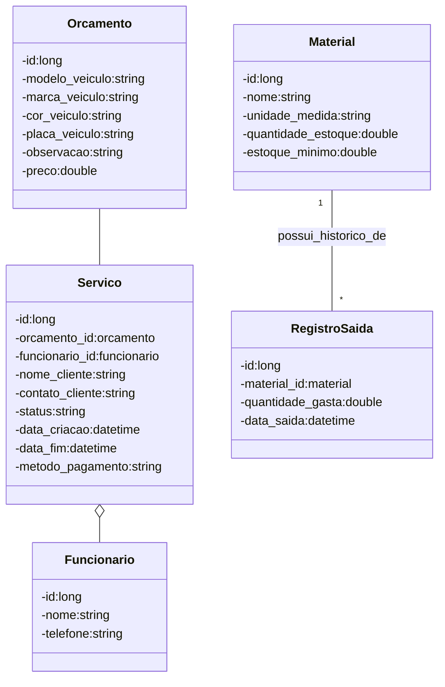

# Diagrama de Classes Atualizado

Aqui está a representação atualizada do seu diagrama de classes. Adicionei a entidade `Material` e uma classe intermediária `ConsumoMaterial` para registrar o quanto de cada material foi gasto em um determinado Serviço.

